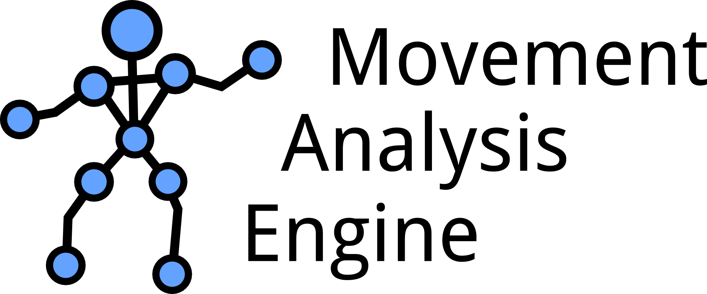

  

The Movement Analysis Engine is able to analyze movements and provide events based on a described movements sequence (Labanotation). The engine can be used by other applications for further movement processing and filtering in ambient spaces (i.e., smart environments).

See the project wiki for more information: https://github.com/furylynx/MAE/wiki

See the API documentation for code documentation: https://codedocs.xyz/furylynx/MAE/

See the readme files for each module of the engine.

To generate the code documentation locally, type:
doxygen mae.doxy

The generated documentation can be found under docs/
